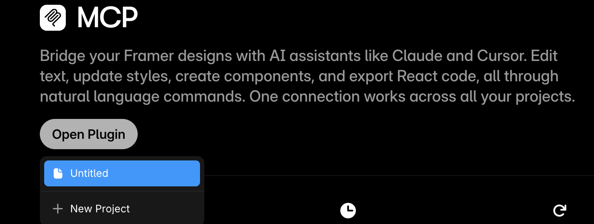

# CMS Best Practices for Framer

The Framer CMS is powerful when used correctly. Here are best practices to help you get the most out of it.

## Content Structure

### Collections

Organize your content into logical collections:

- **Blog Posts**: Articles, tutorials, and updates
- **Projects**: Portfolio items and case studies
- **Team Members**: Staff profiles and bios
- **Products**: E-commerce items or services

### Field Types

Choose the right field type for your content:

| Field Type | Best For |
|------------|----------|
| Plain Text | Titles, short descriptions |
| Rich Text | Long-form content, blog posts |
| Image | Featured images, thumbnails |
| Boolean | Published status, featured flags |
| Date | Publication dates, timestamps |

## Workflow Tips

1. **Plan your structure first**: Map out collections and fields before creating them
2. **Use consistent naming**: Stick to a naming convention for fields and slugs
3. **Leverage relations**: Connect related content across collections
4. **Set defaults**: Define sensible default values for fields
5. **Test with real content**: Always test with actual content, not placeholders

## Integration with GitHub Sync

When using the GitHub Sync plugin:

- Keep markdown files organized in folders
- Use consistent frontmatter across similar content types
- Include relative paths for images
- Commit changes regularly for version control

## Performance Optimization

- Optimize images before uploading
- Use appropriate image formats (WebP when possible)
- Keep collections focused and purposeful
- Archive old content instead of deleting it
